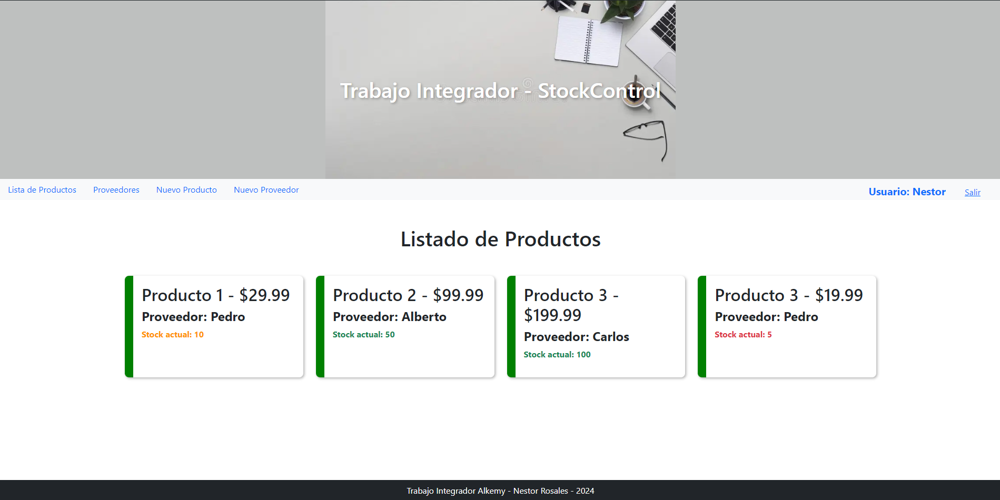
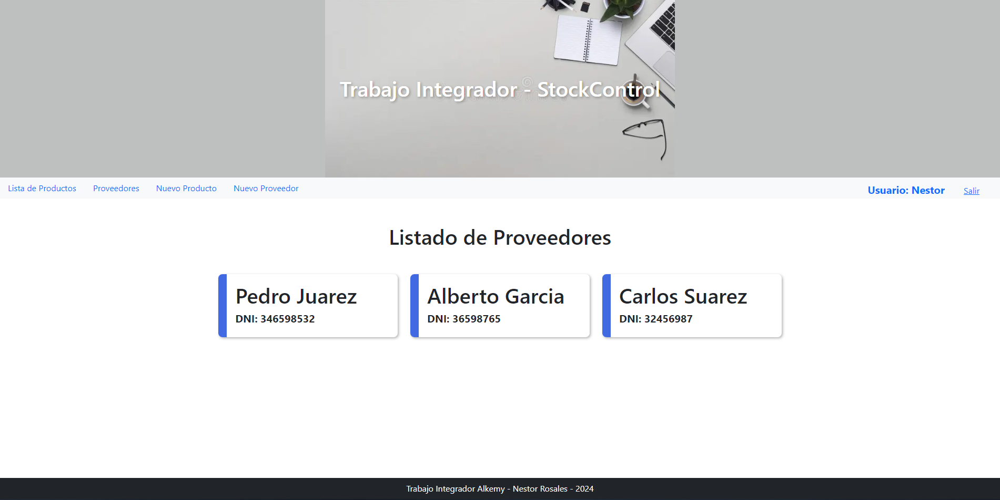
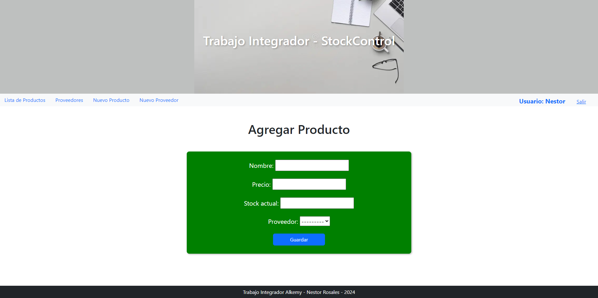
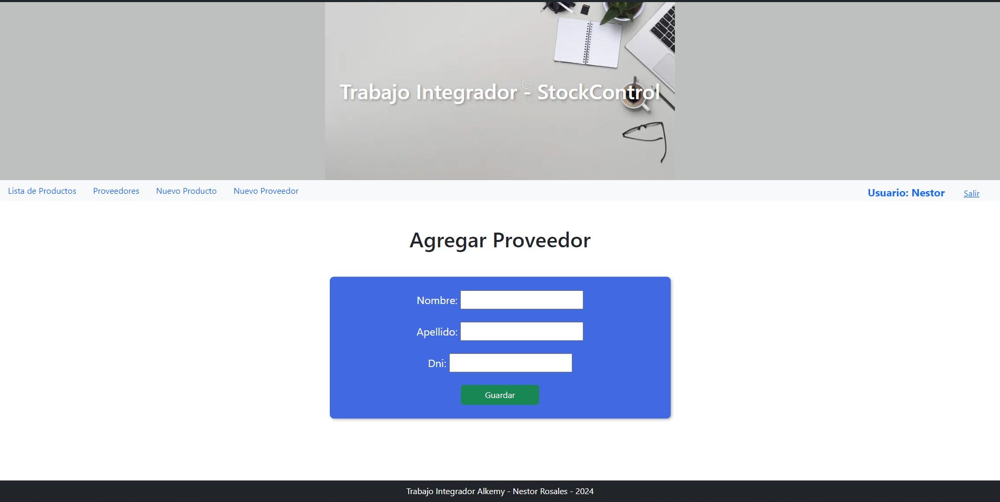
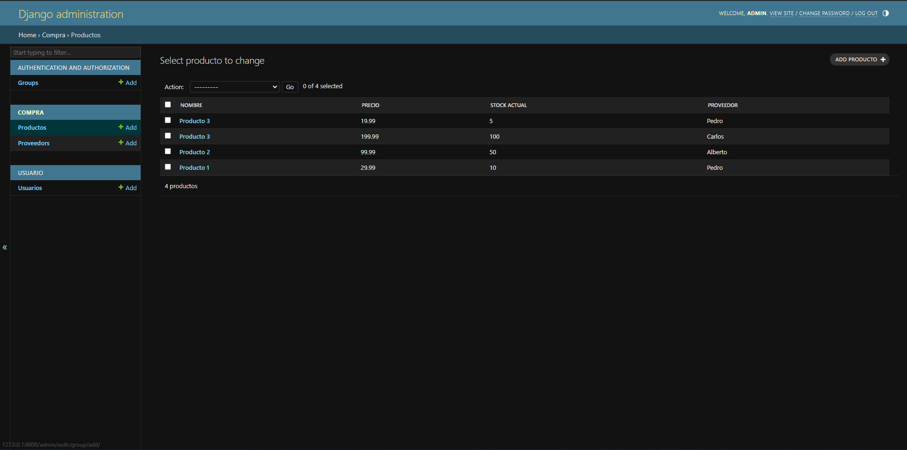
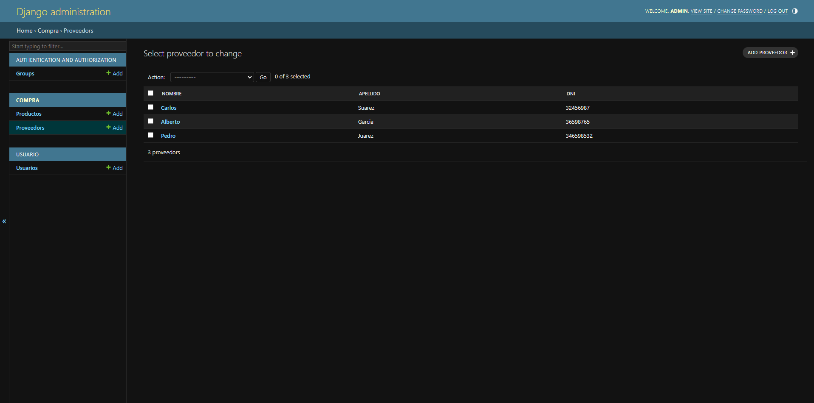
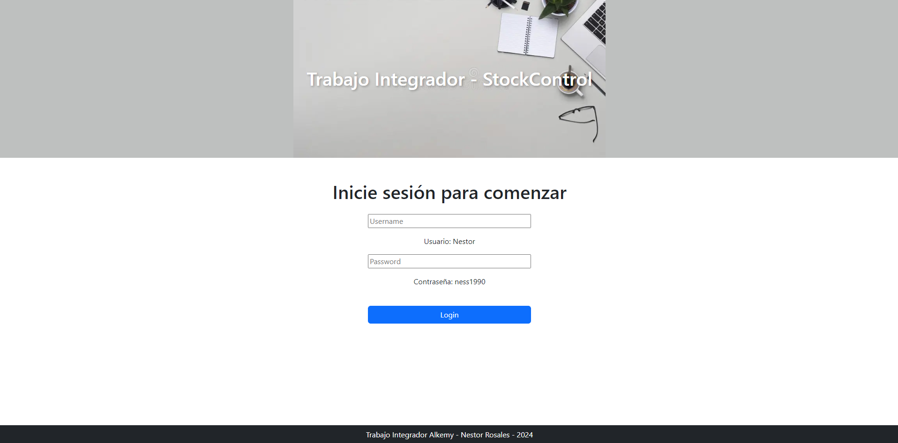

## Proyecto Integrador - StockControl - Alkemy

Alumno: Nestor Rosales

Este es mi proyecto de control de stock realizado en el marco del Plan de Formación Profesional y Continua brindado por la plataforma Alkemy basado en Python y Django.

# Sección Lista de Productos

Además de listar los productos, implementé la lógica para que según la cantidad de stock, el texto se presente de la siguiente manera:

-   Verde: Stock > 30
-   Amarillo: Stock < 30
-   Rojo: Stock < 10

```
<div class="row w-100 mx-auto gap-4 mb-5">
	 
	<div class="col p-3 producto">
		<h2>{{producto.nombre}} - ${{producto.precio}}</h2>
		<h4 class="fw-bold">Proveedor: {{producto.proveedor}}</h4>
		<p
			class="fw-bold  text-danger  warning  text-success "
		>
			Stock actual: {{producto.stock_actual}}
		</p>
	</div>
	 
	<p class="text-center">No hay productos</p>
	
</div>
```



# Sección Lista de Proveedores



# Sección Agregar Producto



# Sección Agregar Proveedor



# Sección Panel Administración para Productos



# Sección Panel Administración para Proveedores



## Funcionalidad de Login

En la rama userCreation implementé que se requiera estar logueado para acceder al sitio y poder realizar las operaciones.


